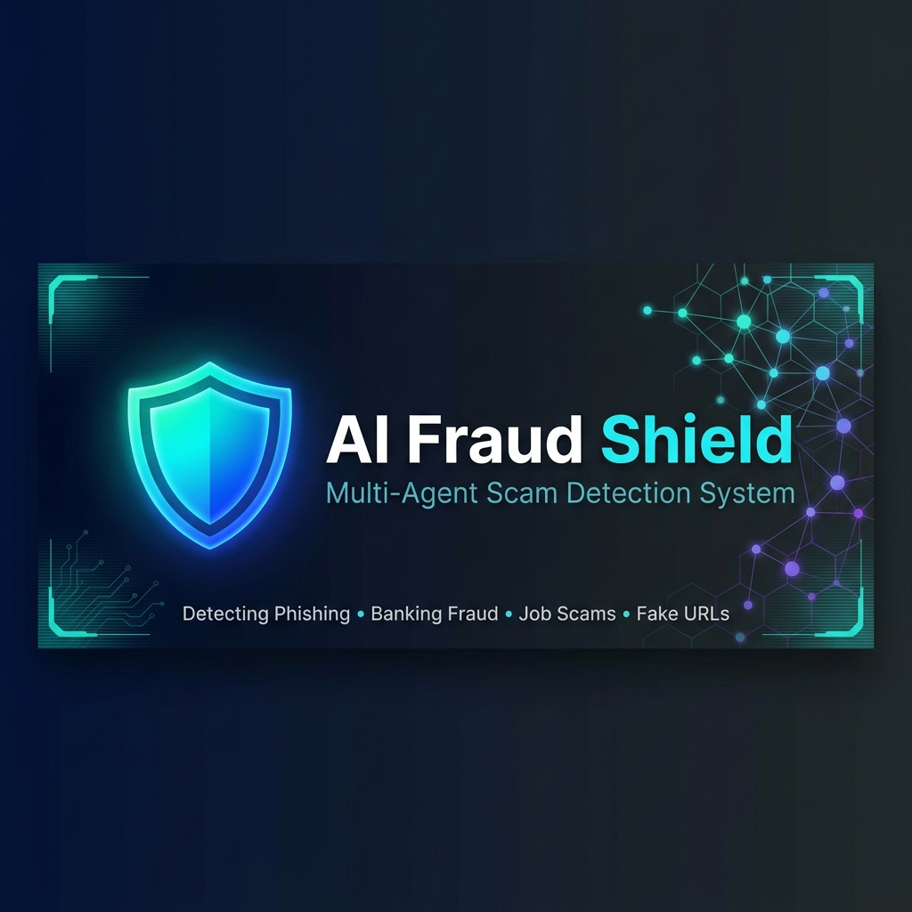
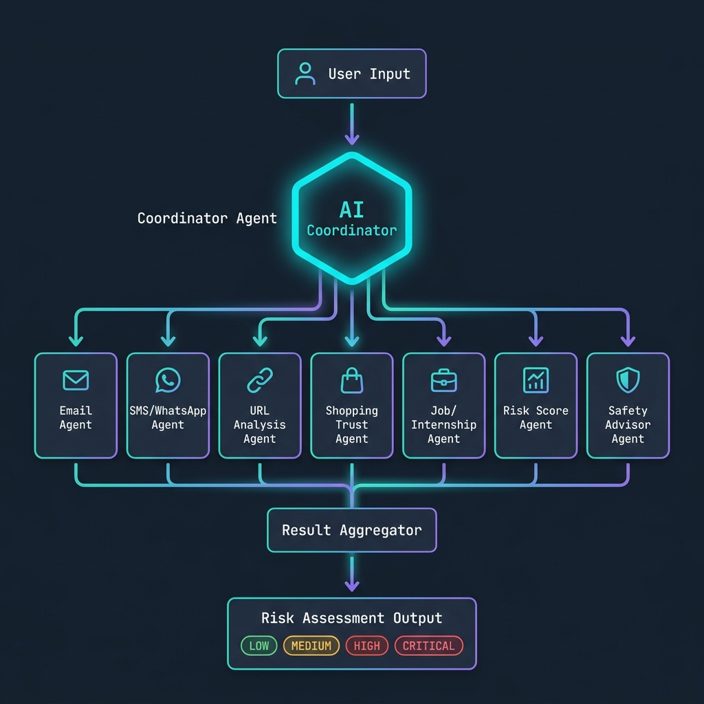

<div align="center">



# 🛡️ CyberScam & Fraud Shield Detection Agent

### An AI-Powered Multi-Agent System for Real-Time Scam & Phishing Detection

[](https://www.python.org/)
[](https://fastapi.tiangolo.com/)
[](https://google.github.io/adk-docs/)
[](https://docs.pydantic.dev/)
[](https://opensource.org/licenses/MIT)
[](tests/)

> Detecting phishing, banking fraud, job scams, fake URLs, WhatsApp smishing, and shopping fraud using an orchestrated multi-agent AI pipeline.

[📖 Documentation](#-architecture) • [🚀 Quick Start](#-quick-start) • [🌐 Dashboard](#-web-dashboard) • [🔌 API Reference](#-api-reference)

</div>

---

## 📋 Table of Contents

- [✨ Key Features](#-key-features)
- [🏗️ Architecture](#️-architecture)
- [🤖 Sub-Agents](#-sub-agents)
- [🌐 Web Dashboard](#-web-dashboard)
- [🚀 Quick Start](#-quick-start)
- [🐳 Docker Deployment](#-docker-deployment)
- [🔌 API Reference](#-api-reference)
- [🧪 Testing](#-testing)
- [📁 Project Structure](#-project-structure)
- [⚙️ Configuration](#️-configuration)
- [🔮 How It Works](#-how-it-works)

---

## ✨ Key Features

| Feature | Description |
|---|---|
| 🧠 **Multi-Agent Orchestration** | Central coordinator dynamically routes requests to specialized sub-agents |
| 🔍 **7 Specialized Detectors** | Email, SMS/WhatsApp, URL, Shopping, Job/Internship, Risk Scoring, Safety Advisor |
| ⚡ **FastAPI Backend** | High-performance REST API with full OpenAPI/Swagger documentation |
| 🖥️ **Live Dashboard UI** | Real-time threat analysis dashboard with log streaming |
| 🎯 **Smart Routing** | Keyword-based + heuristic classification engine selects optimal agents |
| 🛡️ **Error Containment** | Agent failures are isolated — system always returns a result |
| 📊 **Risk Scoring** | 4-tier risk levels: `LOW` / `MEDIUM` / `HIGH` / `CRITICAL` |
| 🐳 **Docker Ready** | One-command containerized deployment |
| ✅ **Fully Tested** | 6 unit tests covering routing, aggregation, and failure containment |

---

## 🏗️ Architecture

<div align="center">



</div>

### System Workflow

```
User Input (Text / URL / Message)
          │
          ▼
┌─────────────────────────┐
│   Coordinator Agent     │  ◄── Central Orchestrator
│  (Request Router)       │
└───────────┬─────────────┘
            │ Routes to specialized agents
    ┌───────┼───────────────────────────────┐
    ▼       ▼       ▼       ▼       ▼       ▼
 Email   SMS/WA   URL   Shopping  Job   Risk+Safety
 Agent   Agent   Agent   Agent   Agent   Agents
    │       │       │       │       │       │
    └───────┴───────┴───────┴───────┴───────┘
                          │
                          ▼
                ┌─────────────────┐
                │ Result Aggregator│
                └────────┬────────┘
                         │
                         ▼
              ┌─────────────────────┐
              │ CoordinatorResponse  │
              │ • overall_risk       │
              │ • recommendation     │
              │ • next_steps         │
              │ • agent_results      │
              └─────────────────────┘
```

---

## 🤖 Sub-Agents

| Agent | Trigger | Detects |
|---|---|---|
| 📧 **Email Scam Detection Agent** | `email`, `phishing`, `verify`, `password`, `lottery` | Phishing links, wire fraud, impersonation, urgency tactics |
| 💬 **SMS & WhatsApp Scam Detection Agent** | `whatsapp`, `sms`, `otp`, `text`, `message` | Smishing, fake OTP requests, emergency impersonation |
| 🔗 **URL Analysis Agent** | `url`, `http`, `link`, `website`, `.com` | Typosquatting, suspicious TLDs, deceptive domains |
| 🛍️ **Shopping Trust Agent** | `shopping`, `store`, `price`, `buy`, `discount` | Fake stores, unrealistic discounts, no-policy sites |
| 💼 **Internship & Job Scam Detection Agent** | `internship`, `job`, `salary`, `hiring`, `telegram` | Pay-to-work scams, fake job offers, advance fee fraud |
| 📊 **Risk Score Agent** | Always runs in multi-agent analysis | Quantitative risk scoring with confidence metrics |
| 🛡️ **Safety Advisor Agent** | Always runs alongside Risk Score | Generates safety recommendations and next-step actions |

---

## 🌐 Web Dashboard

The project includes a fully-featured single-page application (SPA) dashboard.

### Dashboard Sections

| Section | Features |
|---|---|
| 🏠 **Home Overview** | System stats, registered agent list, session metrics |
| 🔍 **Fraud Detector** | Custom query input, agent override, real-time results |
| 🎯 **Scenario Tester** | 7 pre-built capstone scenarios with one-click execution |
| 📈 **Analytics Hub** | Risk distribution charts, run history, confidence metrics |
| 📋 **System Logs** | Live-streaming backend log console with level filtering |

---

## 🚀 Quick Start

### Prerequisites

- Python 3.11 or higher
- pip or a virtual environment manager

### 1. Clone the Repository

```bash
git clone https://github.com/Shaik-Nazneen4/CyberScam-or-Fraud-Shield-Detection-Agent.git
cd CyberScam-or-Fraud-Shield-Detection-Agent
```

### 2. Create a Virtual Environment

```bash
python -m venv .venv

# Windows
.venv\Scripts\activate

# Linux / macOS
source .venv/bin/activate
```

### 3. Install Dependencies

```bash
pip install -r requirements.txt
```

### 4. Run the Application

**Option A — Web Dashboard (Recommended):**
```bash
python server.py
```
Then open your browser at: **http://127.0.0.1:8000**

**Option B — Interactive CLI:**
```bash
python main.py
```

**Option C — Run All 7 Capstone Scenarios:**
```bash
python main.py
# Then press 8 to run all scenarios
```

---

## 🐳 Docker Deployment

```bash
# Build the image
docker build -t fraud-shield .

# Run the container
docker run -p 8080:8080 fraud-shield
```

Access at: **http://localhost:8080**

---

## 🔌 API Reference

The API is fully documented at **http://127.0.0.1:8000/docs** (Swagger UI).

### Endpoints

| Method | Endpoint | Description |
|---|---|---|
| `GET` | `/` | Serve the frontend dashboard SPA |
| `GET` | `/api/agents` | List all registered sub-agents |
| `GET` | `/api/scenarios` | Get all pre-configured capstone scenarios |
| `POST` | `/api/analyze` | Analyze custom scam text |
| `POST` | `/api/run-all` | Run all 7 scenarios in batch |
| `GET` | `/api/logs` | Retrieve buffered backend logs |
| `POST` | `/api/logs/clear` | Clear the log buffer |

### Example: Analyze a Message

```bash
curl -X POST http://127.0.0.1:8000/api/analyze \
  -H "Content-Type: application/json" \
  -d '{"text": "Your account has been suspended. Wire $500 to verify."}'
```

**Response:**
```json
{
  "input_type": "email",
  "selected_agents": ["Email Scam Detection Agent"],
  "overall_risk": "HIGH",
  "analysis_status": "success",
  "recommendation": "HIGH RISK ALERT. Strong indicators of scam/fraud are present...",
  "next_steps": [
    "Do not click any links or reply to this message.",
    "Report this to your email provider as phishing."
  ],
  "agent_results": {
    "Email Scam Detection Agent": {
      "risk_level": "HIGH",
      "confidence": 0.92,
      "findings": ["Urgency tactic detected", "Financial request identified"]
    }
  }
}
```

---

## 🧪 Testing

The project includes a comprehensive unit test suite covering all core components.

```bash
pytest tests/ -v
```

### Test Coverage

| Test | What it Validates |
|---|---|
| `test_registry_registration` | Agent registration and retrieval via dynamic registry |
| `test_routing_decisions` | Keyword router maps input correctly to agent categories |
| `test_coordinator_success_flow` | End-to-end pipeline with successful agent execution |
| `test_coordinator_error_containment` | Failing agent is isolated; system returns `partial_success` |
| `test_coordinator_total_failure` | All agents fail gracefully; returns `failed` status |
| `test_coordinator_manual_agent_override` | Manual agent selection bypasses automatic routing |

---

## 📁 Project Structure

```
CyberScam-or-Fraud-Shield-Detection-Agent/
│
├── 📄 server.py                  # FastAPI backend + REST API endpoints
├── 📄 main.py                    # Interactive CLI harness
├── 📄 check_app.py               # Health check script for all endpoints
├── 📄 requirements.txt           # Python dependencies
├── 📄 Dockerfile                 # Docker container configuration
│
├── 🗂️ fraud_shield/              # Core package
│   ├── coordinator.py            # Central orchestration logic
│   ├── router.py                 # Request classification & agent routing
│   ├── aggregator.py             # Result aggregation & risk scoring
│   ├── registry.py               # Dynamic agent registration system
│   ├── interfaces.py             # Base interfaces & Pydantic models
│   ├── exceptions.py             # Custom exception hierarchy
│   ├── config.py                 # Logging configuration
│   │
│   ├── 🗂️ agents/               # Specialized sub-agents
│   │   ├── email_agent.py        # Email phishing detector
│   │   ├── sms_whatsapp_agent.py # SMS/WhatsApp smishing detector
│   │   ├── url_agent.py          # URL/link analysis agent
│   │   ├── shopping_agent.py     # Shopping site trust agent
│   │   ├── job_agent.py          # Job & internship scam detector
│   │   ├── risk_score_agent.py   # Quantitative risk scoring
│   │   └── safety_advisor_agent.py # Safety recommendations
│   │
│   └── 🗂️ llm/                  # LLM provider abstraction
│       ├── mock_provider.py      # Offline mock provider (default)
│       └── gemini_provider.py    # Google Gemini integration
│
├── 🗂️ static/                    # Frontend SPA
│   ├── index.html                # Main dashboard HTML
│   ├── css/styles.css            # Design system & animations
│   └── js/app.js                 # Dashboard controller (vanilla JS)
│
├── 🗂️ tests/                     # Pytest unit tests
│   └── test_coordinator.py       # 6 comprehensive tests
│
└── 🗂️ docs/                      # Documentation & assets
    └── images/                   # README images
```

---

## ⚙️ Configuration

| Environment Variable | Default | Description |
|---|---|---|
| `HOST` | `127.0.0.1` | Server host address |
| `PORT` | `8000` | Server port |
| `RELOAD` | `true` | Auto-reload on file changes |

### LLM Provider

The system uses a **MockModelProvider** by default (fully offline, no API key needed). To enable Google Gemini:

```python
# In coordinator.py — swap provider
from fraud_shield.llm.gemini_provider import GeminiModelProvider
coordinator = CoordinatorAgent(model_provider=GeminiModelProvider(api_key="YOUR_KEY"))
```

---

## 🔮 How It Works

### 1. Request Classification
The `RequestRouter` analyzes the input text using keyword heuristics and pattern matching to determine the **threat category** (email, sms_whatsapp, url, shopping, job_internship, comprehensive).

### 2. Dynamic Agent Dispatch
The `CoordinatorAgent` looks up the classified agents from the `AgentRegistry` and executes them in parallel, with full error isolation — a failing agent never crashes the pipeline.

### 3. Result Aggregation
The `ResultAggregator` collects all `AgentResult` objects, computes the highest-severity risk level, calculates an average confidence score, and synthesizes a unified `CoordinatorResponse` with a recommendation and next-steps.

### 4. Risk Classification

| Level | Score Range | Meaning |
|---|---|---|
| 🟢 `LOW` | 0–30% | Likely safe, exercise normal caution |
| 🟡 `MEDIUM` | 31–60% | Some suspicious indicators, verify independently |
| 🔴 `HIGH` | 61–85% | Strong fraud indicators, avoid interaction |
| 🔴 `CRITICAL` | 86–100% | Confirmed scam pattern, do not engage |

---

## 📜 License

This project is licensed under the **MIT License** — see the [LICENSE](LICENSE) file for details.

---

## 🙏 Acknowledgements

- Built as part of the **Infosys Springboard Virtual Internship Program 7.0**
- Powered by [Google Agent Development Kit (ADK)](https://google.github.io/adk-docs/)
- Backend: [FastAPI](https://fastapi.tiangolo.com/) + [Uvicorn](https://www.uvicorn.org/)
- Data validation: [Pydantic v2](https://docs.pydantic.dev/)

---

<div align="center">

Made with ❤️ by **Shaik Nazneen** | [GitHub](https://github.com/Shaik-Nazneen4)

⭐ Star this repository if you found it helpful!

</div>
